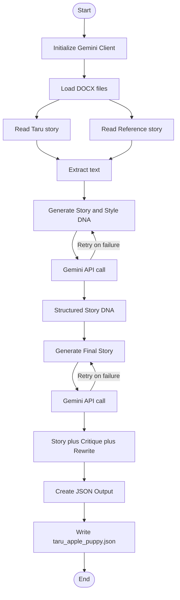

# Generating a 400 word toddler story with the help of a reference story using **Google Gemini API** and **Python docx** library and saving the output in a **.JSON Folder**

This project is about generating a story for toddlers (3-4 years of age) using the **Google Gemini API** and saving the output in **.JSON File**

## Workflow

## Steps to Run the Code

1. Cloning the repository:

git clone: https://github.com/blackstag2k/Retry-Blog-Evaluation.git

2. Installing the Dependencies for the project:

* dependencies listed in the requirements.txt

pip install -r requirements.txt 

* If you want to execute the installed pip module instead of a script file, then use the command below in Command Window

pip -m install -r requirements.txt

### Example:

- python -m pip install google-generativeai

3. Add your API Key 

* Google AI API, Open AI API, etc. generated from any platform. Google GenAI key is used here. I have hardcoded the API key. However, I won't recommend hardcoding, rather you can save it as an environment variable. 

export GOOGLE_API_KEY="YOUR_KEY"

4. Run

python main.py

**Output**

Output JSON:
## 🧠 LLM Story Control System

This table shows how a **structured prompt (Story + Style DNA)** becomes a **controlled narrative output**.

| **Prompt Seed (Story + Style DNA)** | **LLM Output (Generated Story)** |
|-----------------------------------|----------------------------------|
| **Core Theme**    Small acts of sharing foster community connection and amplify joy.     **Emotional Arc**    Wonder → Worry → Hope → Surprise → Choice → Warm Joy     **Protagonist**    Taru (4 years old)     **Setting**    Himalayan mountain village with stone lanes, pine scent, chai steam, and goat bells     **Conflict**    Taru wants her apple, but a hungry baby goat needs it     **Tone & Style**    Joyful, warm, expressive, rhythmic, with repetition and emojis | **Taru’s Shiny Apple**     Taru skipped down the stone lane, holding her shiny red apple. “Zoom! Zoom! 🍎” she sang. It was so red, so shiny — she loved it, loved it, loved it!     Oops! 😱 The apple slipped and rolled down the terraced path into the sunshine. “My apple! My apple!”     A tiny baby goat was nibbling it. “Baa-baa-baa!” it cried, so hungry. Taru’s heart tugged — she wanted her apple, but the goat needed it.     Mama knelt beside her. “Sometimes sharing makes everything bloom,” she whispered.     Taru broke the apple in half. “Here you go, baa-baa!”     Soon villagers shared greens and bread, and laughter filled the lane. “Sharing is fun!” Taru beamed as warmth spread through the whole village. 🌞 |

## Tools Used

- Google AI API (Gemini)
- Python 3.14

## Lessons to be Learned

- Using two different docuement files, one of the Taru story and the other as a reference file of the Big Blue Friendship Train through the *Python docx* library.
- Learning how to use *retry* process and understanding the usage of *MAX_RETRIES*, *except*, and *RETRY_DELAY*.
- Using prompt engineering basics to seperate system and user prompts. The former stays the same and the latter variable or dynamic.
- Executing the code through a virtual environment (.venv) like VS Code.
- Prompt chaining to execute a prompt (system and user prompt) and get the best results.

Documented during the Prompt Engineering Course for Prompt Chaining and Content Generation

